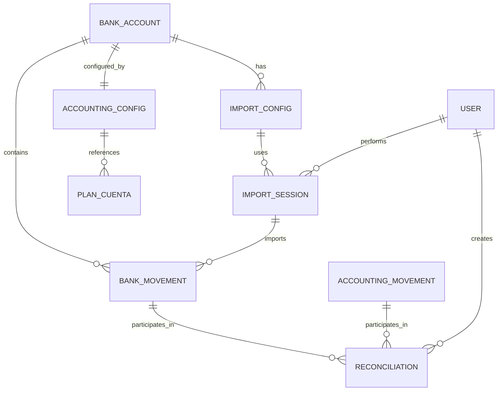

# Design Document - Módulo de Conciliación Bancaria

## Overview

El módulo de conciliación bancaria se diseña como un sistema modular que se integra perfectamente con la arquitectura existente del sistema contable. Utiliza un enfoque de procesamiento por lotes para la importación, algoritmos de matching inteligente para la conciliación automática, y una interfaz intuitiva para la revisión manual. El diseño prioriza la escalabilidad, la trazabilidad completa y la integración seamless con el módulo contable existente.

## Architecture

### Arquitectura de Capas

```
┌─────────────────────────────────────────────────────────────┐
│                    Frontend (React/Next.js)                 │
├─────────────────────────────────────────────────────────────┤
│                     API Layer (FastAPI)                     │
├─────────────────────────────────────────────────────────────┤
│                    Business Logic Layer                     │
│  ┌─────────────────┐ ┌─────────────────┐ ┌───────────────┐ │
│  │ Import Service  │ │ Matching Engine │ │ Report Service│ │
│  └─────────────────┘ └─────────────────┘ └───────────────┘ │
├─────────────────────────────────────────────────────────────┤
│                    Data Access Layer                        │
├─────────────────────────────────────────────────────────────┤
│                Database (PostgreSQL/SQLite)                 │
└─────────────────────────────────────────────────────────────┘
```

### Componentes Principales

1. **Import Engine**: Procesamiento de archivos bancarios
2. **Matching Engine**: Algoritmos de conciliación automática
3. **Manual Review Interface**: Herramientas de revisión manual
4. **Adjustment Generator**: Creación automática de asientos
5. **Report Generator**: Generación de reportes y exportes
6. **Configuration Manager**: Gestión de configuraciones bancarias

## Components and Interfaces

### 1. Import Engine

**Responsabilidades:**
- Validación de formatos de archivo
- Parsing de extractos bancarios
- Detección de duplicados
- Almacenamiento temporal de movimientos

**Interfaces:**
```python
class ImportEngine:
    def validate_file(self, file_path: str, config_id: int) -> ValidationResult
    def parse_bank_statement(self, file_path: str, config: ImportConfig) -> List[BankMovement]
    def detect_duplicates(self, movements: List[BankMovement]) -> DuplicateReport
    def store_movements(self, movements: List[BankMovement], import_session_id: str) -> ImportResult
```

### 2. Matching Engine

**Responsabilidades:**
- Comparación automática de movimientos
- Algoritmos de matching por múltiples criterios
- Scoring de coincidencias probables
- Gestión de reglas de matching configurables

**Interfaces:**
```python
class MatchingEngine:
    def auto_match(self, bank_movements: List[BankMovement], 
                   accounting_movements: List[AccountingMovement]) -> MatchingResult
    def suggest_matches(self, unmatched_movements: List[BankMovement]) -> List[MatchSuggestion]
    def apply_manual_match(self, bank_movement_id: int, 
                          accounting_movement_ids: List[int]) -> MatchResult
```

### 3. Configuration Manager

**Responsabilidades:**
- Gestión de configuraciones de importación
- Mapeo de campos bancarios
- Configuración de cuentas contables
- Validación de configuraciones

**Interfaces:**
```python
class ConfigurationManager:
    def create_import_config(self, bank_id: int, config_data: ImportConfigData) -> ImportConfig
    def validate_config(self, config: ImportConfig, sample_file: str) -> ValidationResult
    def get_accounting_config(self, bank_account_id: int) -> AccountingConfig
```

## Data Models

### Core Entities

```python
# Configuración de Importación
class ImportConfig(BaseModel):
    id: int
    bank_id: int
    name: str
    file_format: str  # CSV, TXT, XLS
    delimiter: str
    date_format: str
    field_mapping: Dict[str, int]  # campo -> posición
    header_rows: int
    created_at: datetime
    updated_at: datetime

# Movimiento Bancario
class BankMovement(BaseModel):
    id: int
    import_session_id: str
    bank_account_id: int
    transaction_date: date
    value_date: date
    amount: Decimal
    description: str
    reference: str
    transaction_type: str
    balance: Optional[Decimal]
    status: str  # PENDING, MATCHED, ADJUSTED
    created_at: datetime

# Movimiento Contable
class AccountingMovement(BaseModel):
    id: int
    document_id: int
    account_id: int
    transaction_date: date
    amount: Decimal
    description: str
    reference: str
    debit_credit: str
    reconciliation_status: str  # UNRECONCILED, RECONCILED

# Conciliación
class Reconciliation(BaseModel):
    id: int
    bank_movement_id: int
    accounting_movement_ids: List[int]
    reconciliation_type: str  # AUTO, MANUAL, ADJUSTMENT
    user_id: int
    reconciliation_date: datetime
    notes: Optional[str]
    status: str  # ACTIVE, REVERSED

# Sesión de Importación
class ImportSession(BaseModel):
    id: str
    bank_account_id: int
    file_name: str
    file_hash: str
    import_config_id: int
    total_movements: int
    successful_imports: int
    errors: List[str]
    user_id: int
    import_date: datetime
    status: str  # PROCESSING, COMPLETED, FAILED

# Configuración Contable
class AccountingConfig(BaseModel):
    id: int
    bank_account_id: int
    commission_account_id: int
    interest_income_account_id: int
    bank_charges_account_id: int
    adjustment_account_id: int
    default_cost_center_id: Optional[int]
    created_at: datetime
    updated_at: datetime
```

### Relationship Diagram



## Correctness Properties

*A property is a characteristic or behavior that should hold true across all valid executions of a system-essentially, a formal statement about what the system should do. Properties serve as the bridge between human-readable specifications and machine-verifiable correctness guarantees.*
### Property Reflection

Después de revisar todas las propiedades identificadas en el prework, se pueden consolidar algunas propiedades redundantes:

- Las propiedades de validación de archivos (1.1, 1.3) pueden combinarse en una propiedad integral de validación
- Las propiedades de generación de asientos (5.1, 5.2, 5.3) pueden unificarse en una propiedad general de generación automática
- Las propiedades de reportes (6.1, 6.2, 6.3) pueden consolidarse en una propiedad de generación completa de reportes
- Las propiedades de auditoría (4.4, 8.2) pueden combinarse en una propiedad integral de trazabilidad

### Correctness Properties

Property 1: File validation completeness
*For any* uploaded bank statement file, the validation process should either accept the file with successful parsing or reject it with specific error details, never partially processing invalid data
**Validates: Requirements 1.1, 1.3**

Property 2: Import data integrity
*For any* valid bank statement file, all movements in the file should be imported and stored with complete traceability to the source file
**Validates: Requirements 1.2, 1.5**

Property 3: Duplicate detection accuracy
*For any* set of bank movements being imported, the system should correctly identify all duplicates based on date, amount, and reference matching
**Validates: Requirements 1.4**

Property 4: Configuration validation completeness
*For any* import configuration, all mandatory fields must be mapped and validated before the configuration can be saved and used
**Validates: Requirements 2.2, 2.5**

Property 5: Configuration auditability
*For any* configuration change, the system should maintain a complete audit trail with timestamps, users, and change details
**Validates: Requirements 2.4**

Property 6: Automatic matching accuracy
*For any* set of bank and accounting movements, exact matches should be identified and reconciled automatically, while partial matches should be suggested with confidence scores
**Validates: Requirements 3.1, 3.2, 3.3**

Property 7: Manual reconciliation flexibility
*For any* manual reconciliation operation, the system should allow one-to-many and many-to-one matching while maintaining complete audit trails
**Validates: Requirements 4.2, 4.4**

Property 8: Reconciliation reversibility
*For any* completed reconciliation, the system should allow reversal while maintaining complete traceability of both the original and reversal operations
**Validates: Requirements 4.5**

Property 9: Automatic adjustment generation
*For any* identified bank charge, commission, or interest, the system should generate appropriate accounting entries using configured accounts and allow preview before confirmation
**Validates: Requirements 5.1, 5.2, 5.3, 5.4**

Property 10: Accounting integration consistency
*For any* confirmed adjustment entry, the system should integrate it into the accounting system with proper references and maintain consistency with the chart of accounts
**Validates: Requirements 5.5, 7.2**

Property 11: Report completeness and accuracy
*For any* reconciliation report request, the system should include all relevant movements, balances, and adjustments for the specified period with accurate calculations
**Validates: Requirements 6.1, 6.2, 6.3**

Property 12: Security and access control
*For any* user operation, the system should validate permissions and log all activities with complete audit information
**Validates: Requirements 8.1, 8.2, 8.4**

Property 13: Configuration temporal consistency
*For any* accounting configuration change, the system should apply changes only to future reconciliations while preserving historical data integrity
**Validates: Requirements 7.4**

## Error Handling

### Error Categories

1. **File Processing Errors**
   - Invalid file format or encoding
   - Missing required fields
   - Data type mismatches
   - Corrupted file data

2. **Business Logic Errors**
   - Duplicate movement detection
   - Invalid account configurations
   - Insufficient permissions
   - Data validation failures

3. **Integration Errors**
   - Database connectivity issues
   - External system communication failures
   - Transaction rollback scenarios
   - Concurrent access conflicts

### Error Handling Strategy

```python
class ReconciliationError(Exception):
    def __init__(self, error_code: str, message: str, details: Dict = None):
        self.error_code = error_code
        self.message = message
        self.details = details or {}
        super().__init__(self.message)

class ErrorHandler:
    def handle_import_error(self, error: Exception, context: ImportContext) -> ErrorResponse
    def handle_matching_error(self, error: Exception, context: MatchingContext) -> ErrorResponse
    def handle_adjustment_error(self, error: Exception, context: AdjustmentContext) -> ErrorResponse
```

### Recovery Mechanisms

- **Transactional Processing**: All operations wrapped in database transactions
- **Rollback Capabilities**: Ability to undo operations with full state restoration
- **Retry Logic**: Automatic retry for transient failures
- **Manual Intervention**: Clear escalation paths for complex errors

## Testing Strategy

### Unit Testing Approach

Unit tests will focus on individual components and their specific behaviors:

- **Import Engine**: Test file parsing, validation logic, and error handling
- **Matching Engine**: Test matching algorithms, scoring mechanisms, and edge cases
- **Configuration Manager**: Test validation rules, persistence, and retrieval
- **Report Generator**: Test report generation, formatting, and export functionality

### Property-Based Testing Framework

The system will use **Hypothesis** (Python) for property-based testing to verify correctness properties across large input spaces.

**Configuration Requirements:**
- Minimum 100 iterations per property test
- Smart generators for realistic test data
- Shrinking capabilities for minimal failing examples

**Test Data Generators:**
```python
@given(
    bank_movements=lists(bank_movement_strategy(), min_size=1, max_size=100),
    accounting_movements=lists(accounting_movement_strategy(), min_size=1, max_size=100)
)
def test_matching_accuracy_property(bank_movements, accounting_movements):
    # Property test implementation
    pass
```

### Integration Testing

- **Database Integration**: Test with real database transactions
- **File System Integration**: Test with actual file uploads and processing
- **API Integration**: Test complete request-response cycles
- **Cross-Module Integration**: Test interaction with existing accounting modules

### Performance Testing

- **Large File Processing**: Test with files containing 10,000+ movements
- **Concurrent Operations**: Test multiple users performing reconciliations simultaneously
- **Memory Usage**: Monitor memory consumption during large imports
- **Response Times**: Ensure sub-second response for common operations

### Security Testing

- **Permission Validation**: Test access control at all levels
- **Data Isolation**: Verify multi-tenant data separation
- **Input Sanitization**: Test against injection attacks
- **Audit Trail Integrity**: Verify complete and tamper-proof logging

## Implementation Phases

### Phase 1: Core Infrastructure (Weeks 1-2)
- Database schema creation
- Basic models and repositories
- File upload and validation framework
- Configuration management foundation

### Phase 2: Import Engine (Weeks 3-4)
- File parsing implementation
- Import configuration system
- Duplicate detection algorithms
- Error handling and validation

### Phase 3: Matching Engine (Weeks 5-6)
- Automatic matching algorithms
- Manual matching interface
- Reconciliation management
- Matching confidence scoring

### Phase 4: Adjustment Generation (Weeks 7-8)
- Automatic adjustment detection
- Accounting entry generation
- Integration with existing accounting system
- Preview and confirmation workflows

### Phase 5: Reporting and UI (Weeks 9-10)
- Report generation system
- Export functionality
- Complete user interface
- Dashboard and summary views

### Phase 6: Security and Audit (Weeks 11-12)
- Permission system integration
- Comprehensive audit logging
- Security testing and hardening
- Performance optimization

## Integration Points

### Existing System Integration

1. **Authentication System**: Leverage existing user management and permissions
2. **Accounting Module**: Integration with chart of accounts and document generation
3. **Company Management**: Multi-tenant support using existing company structure
4. **Audit System**: Extension of existing audit logging capabilities

### Database Integration

```sql
-- Integration with existing tables
ALTER TABLE plan_cuenta ADD COLUMN is_bank_reconciliation_account BOOLEAN DEFAULT FALSE;
ALTER TABLE documento ADD COLUMN reconciliation_reference VARCHAR(255);
ALTER TABLE movimiento_contable ADD COLUMN reconciliation_status VARCHAR(50) DEFAULT 'UNRECONCILED';
```

### API Integration Points

```python
# Integration with existing services
class ReconciliationService:
    def __init__(self, 
                 documento_service: DocumentoService,
                 plan_cuenta_service: PlanCuentaService,
                 usuario_service: UsuarioService):
        self.documento_service = documento_service
        self.plan_cuenta_service = plan_cuenta_service
        self.usuario_service = usuario_service
```

## Performance Considerations

### Scalability Requirements

- **File Size**: Support files up to 50MB (approximately 100,000 movements)
- **Concurrent Users**: Support 10+ simultaneous reconciliation processes
- **Response Time**: Sub-second response for matching operations
- **Storage**: Efficient storage of historical reconciliation data

### Optimization Strategies

1. **Indexing Strategy**: Optimized database indexes for matching queries
2. **Caching**: Redis caching for frequently accessed configurations
3. **Batch Processing**: Chunked processing for large file imports
4. **Lazy Loading**: On-demand loading of detailed movement data

### Monitoring and Metrics

- **Import Performance**: Track file processing times and throughput
- **Matching Accuracy**: Monitor automatic matching success rates
- **User Activity**: Track reconciliation completion times and patterns
- **System Health**: Monitor memory usage, database performance, and error rates