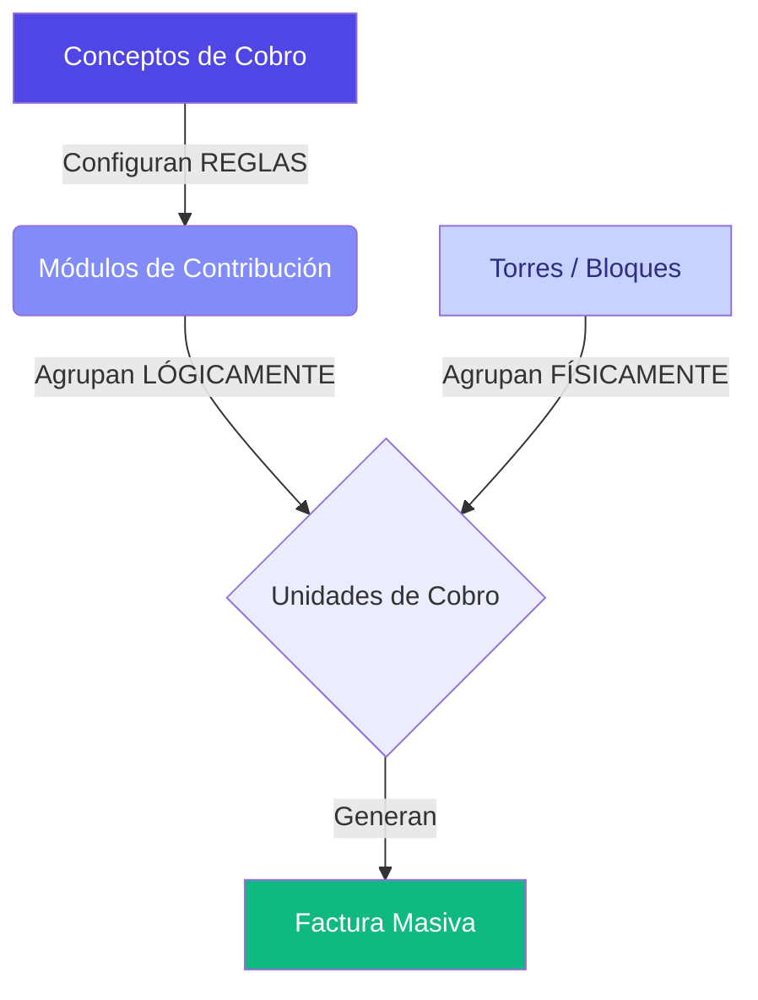

# Capítulo: Panorama General del Modelo de Recaudos (Recuperación de Cartera)

## 1. La Filosofía del Sistema: "Flexibilidad sin Caos"

En el mundo de la administración de copropiedades (y otros sectores de recaudo masivo), el mayor desafío no es cobrar, sino **adaptar el cobro a la realidad física y jurídica de la entidad**. No todas las unidades son iguales, no todos los bloques están en las mismas condiciones y no todos los conceptos de cobro deben afectar a todos por igual.

Nuestra plataforma ha sido diseñada bajo un paradigma de **Consultoría de Negocio**, donde el software no impone una estructura rígida, sino que se convierte en un lienzo para modelar la operación financiera.

### ¿Qué resolvemos?
*   **Segmentación Inteligente**: Poder cobrar administración de locales a unos y residencial a otros en el mismo mes.
*   **Localización de Gastos**: Si una torre necesita pintura, solo esa torre paga por ella, manteniendo la equidad financiera.
*   **Automatización Contable**: Cada cobro está amarrado a una cuenta del PUC, eliminando errores manuales al facturar.
*   **Integridad de Cartera**: El sistema reconoce saldos a favor (anticipos) y los cruza automáticamente si se desea.

---

## 2. La Arquitectura del Cobro (Panorama de Conexión)

Para entender cómo funciona el módulo de recaudos, debemos visualizarlo como una serie de capas que se conectan entre sí. Aquí es donde reside la "magia" del sistema:

### Los Cuatro Pilares:

1.  **Las Unidades (El destino)**: Son los átomos del sistema. Un apartamento, un local, un bus, un alumno. Cada unidad tiene un **propietario** y un **coeficiente** (peso financiero).
2.  **Las Torres/Bloques (La ubicación)**: Es la agrupación por ubicación física. Permite decir: "Esto es del Bloque A".
3.  **Los Módulos de Contribución (La lógica)**: Es la agrupación por **naturaleza**. Un apartamento puede pertenecer al "Módulo Residencial" y al mismo tiempo una torre completa puede pertenecer al "Módulo de Pintura".
4.  **Los Conceptos (La regla)**: Es el "qué" se cobra. Aquí definimos si el cobro es por coeficiente, si es fijo, a qué cuenta contable va y a qué **Módulos** afecta.

---

## 3. Ejemplo Práctico: El caso del Condominio Mixto

Imagine un conjunto que tiene apartamentos y locales comerciales.

*   **Paso 1**: Creamos el Concepto "Administración Residencial" y lo vinculamos al "Módulo Residencial".
*   **Paso 2**: Creamos el Concepto "Administración Comercial" y lo vinculamos al "Módulo Locales".
*   **Paso 3**: Al matricular las unidades, simplemente las "afiliamos" al módulo que les corresponde.

**Resultado**: En un solo clic de "Facturación Masiva", el sistema discrimina automáticamente quién paga qué, sin riesgo de cruces indebidos.

---

> [!TIP]
> **Visión de Negocio**: Esta estructura permite que el administrador justifique cada cobro ante una asamblea o junta con total transparencia, ya que el sistema guarda la trazabilidad de por qué una unidad está siendo afectada por un concepto específico.

---
*Fin del Capítulo 1 - En el siguiente capítulo profundizaremos en el Inventario Físico: Unidades y Torres.*
