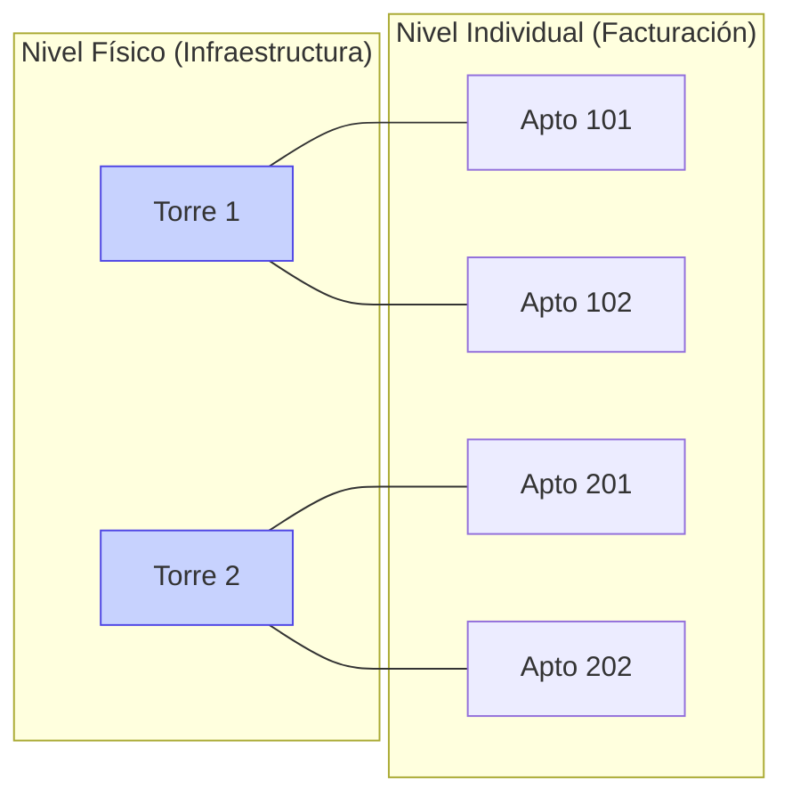

# Capítulo 2: El Inventario Físico (Unidades y Torres)

## 1. La Unidad: El Centro de Gravedad

En nuestro modelo, la **Unidad** es mucho más que un simple número de apartamento o local; es una **Entidad Financiera Autónoma**. Cada vez que creamos una unidad, estamos definiendo un punto de recaudo que tiene sus propias reglas de juego.

### Atributos Clave desde la Consultoría:
*   **Código de Identificación**: El nombre "público" (Ej: Ap. 501, Local 10, Bus 45).
*   **Coeficiente de Copropiedad**: Este es el factor más importante. Define qué porcentaje del gasto total le corresponde a esa unidad. Un error en el coeficiente es un error en la equidad del cobro.
*   **Vínculo Jurídico**: Cada unidad está ligada a un **Propietario** (Tercero) en la base de datos contable. Esto asegura que la Cartera (lo que nos deben) sea real y legalmente exigible.

---

## 2. Gestión de Torres: Agrupación por Ubicación

La **Torre** (o Bloque, Manzana, Zona) representa la **realidad física** del condominio. Mientras que las unidades son individuales, las torres nos permiten manejar la infraestructura.

### ¿Por qué es vital esta separación?
Imagine que el Condominio tiene 10 Torres. La **Torre 4** sufre una inundación y requiere un arreglo especial en sus tuberías que NO afecta a las demás torres.

*   Si solo tuviéramos unidades sueltas, el administrador tendría que buscar una por una las unidades de la Torre 4 para cobrarles una "Cuota Extra".
*   Al tener **Gestión de Torres**, el sistema ya sabe quién pertenece a dónde. Solo decimos: "Cobrar Concepto 'Arreglo Tubería' a la Torre 4".

---

## 3. La Relación Visual

Así es como el sistema entiende el inventario:

### El Diferenciador: La Torre como Filtro
El sistema permite que las Torres actúen como un **Filtro de Seguridad**. Cuando usted crea una regla de cobro, puede restringirla a una torre específica. Esto evita que, por error humano, le cobremos el mantenimiento del ascensor de la Torre A a los residentes de la Torre B (que quizás no tienen ascensor).

---

> [!IMPORTANT]
> **Dato de Valor**: En sectores como el transporte, una "Torre" puede ser una "Ruta" o una "Cooperativa Intermunicipal". La lógica es la misma: agrupar unidades físicas que comparten una misma realidad operativa.

---
*Fin del Capítulo 2 - En el siguiente capítulo entraremos en el mundo de los Módulos de Contribución: La inteligencia detrás del cobro.*
