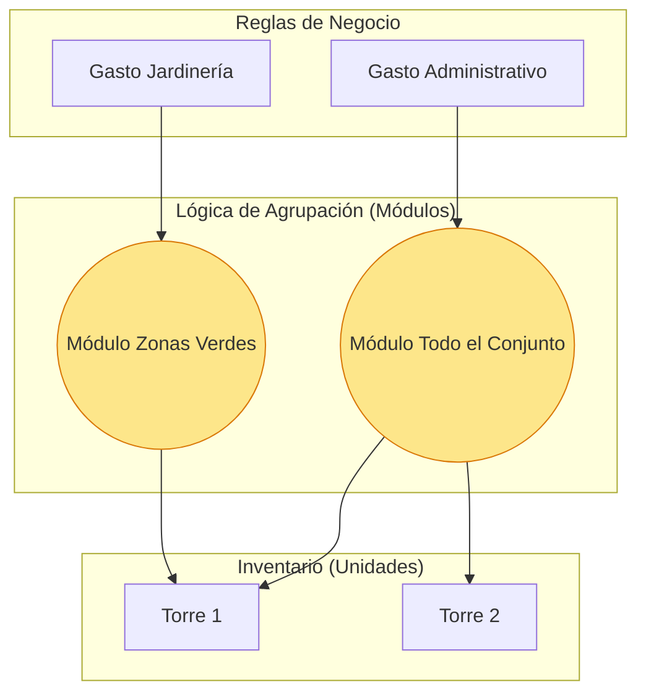

# Capítulo 3: La Lógica de Segmentación (Módulos y Conceptos)

## 1. Módulos de Contribución: El "Cerebro" de la Agrupación

Si las Torres representan la ubicación física, los **Módulos de Contribución** representan la **Naturaleza del Cobro**. Son agrupadores lógicos que permiten segmentar a las unidades sin importar dónde estén físicamente ubicadas.

### El Concepto de "Multi-Pertenencia"
A diferencia de una Torre (donde un apartamento solo puede estar en una torre), una Unidad puede pertenecer a **varios Módulos** al mismo tiempo. Esto es lo que da al sistema una potencia ilimitada.

**Ejemplo en un Condominio Mixto:**
*   **Apto 501**: Pertenece al *Módulo Residencial* y al *Módulo de Piscina*.
*   **Local 01**: Pertenece al *Módulo Comercial* y al *Módulo de Parqueaderos Visitantes*.

Al facturar, el sistema simplemente pregunta: "¿Qué conceptos se aplican al Módulo Residencial?". Y automáticamente el Apto 501 queda incluido, pero el Local 01 queda fuera.

---

## 2. Conceptos de Cobro: Las Reglas del Juego

El **Concepto** es la definición de **qué se va a cobrar y cómo**. Es el puente entre la necesidad administrativa y la realidad contable.

### Anatomía de un Concepto:
1.  **Nombre**: "Administración", "Mora", "Fondo de Reserva".
2.  **Configuración Financiera**:
    *   **Fijo**: Un valor exacto (Ej: $50,000 para todos).
    *   **Por Coeficiente**: El valor base se multiplica por el coeficiente de cada unidad (Ej: $1,000,000 x 0.0245).
3.  **Conexión Contable (Crucial)**: Cada concepto apunta a una cuenta del PUC (Plan Único de Cuentas). Esto garantiza que la contabilidad se alimente en tiempo real al generar el cobro.
4.  **Vinculación a Módulo**: Aquí es donde se cierra el círculo. El concepto NO se le asigna a una unidad, **se le asigna a un Módulo**.

---

## 3. Visualizando la Inteligencia del Sistema

### ¿Por qué esto es mejor que el modelo tradicional?
En sistemas tradicionales, si el administrador quiere cobrar "Jardinería" solo a las casas (porque los apartamentos no tienen jardín), tiene que editar manualmente a cada cliente.

En nuestro sistema:
1.  Creamos el Módulo "Casas con Jardín".
2.  Vinculamos el Concepto "Mantenimiento Jardín" a ese módulo.
3.  **¡Listo!** El sistema se encarga de que a los apartamentos nunca les llegue ese cobro, garantizando la **Paz Vecinal** y la **Transparencia Financiera**.

---

> [!TIP]
> **Consultoría Pro**: Esta misma lógica permite crear "Módulos de Excepción". Si un propietario tiene un acuerdo especial donde no paga administración por 3 meses, simplemente lo sacamos del módulo temporalmente. Sin borrar facturas antiguas ni alterar el historial.

---
*Fin del Capítulo 3 - En el último capítulo veremos la Articulación Maestra: El momento de la facturación.*
