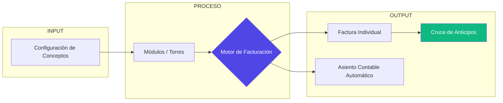

# Capítulo 4: Articulación Maestra y Casos Prácticos

## 1. La Sinfonía de la Facturación Masiva

Llegamos al punto donde todos los elementos que hemos visto (Unidades, Torres, Módulos y Conceptos) se unen para trabajar en armonía. La **Facturación Masiva** no es simplemente un proceso de "generar recibos", es un motor de ejecución de reglas de negocio.

### ¿Cómo "piensa" el sistema al facturar?
Cuando usted presiona el botón de facturación, el software realiza este recorrido lógico por milisegundos:

1.  **Identifica los Conceptos**: ¿Qué vamos a cobrar hoy? (Ej: Administración e Intereses).
2.  **Busca el Destino (Módulos)**: ¿A qué módulos afectan estos conceptos? (Ej: Módulo Residencial).
3.  **Filtra por Ubicación (Torres)**: ¿Hay alguna restricción por torre? (Ej: Solo los del Bloque 1).
4.  **Calcula el Valor**:
    *   ¿Usa Coeficiente? Entonces busca el área de la unidad.
    *   ¿Es Interés? Busca el saldo pendiente y aplica la tasa configurada.
5.  **Cruce Automático**: ¿Esta unidad tiene saldos a favor (Anticipos)? Si es así, los descuenta de inmediato para que el residente vea su saldo real.

---

## 2. Casos de Éxito: Resolviendo Problemas Reales

### Caso A: "La Pintura Selectiva" (Problema de Equidad)
*   **Problema**: Solo se pintará el Bloque 4. Los de los otros bloques no deben pagar.
*   **Solución**:
    1.  Creamos el Concepto "Cuota Extra Pintura".
    2.  Al facturar, seleccionamos ese concepto y aplicamos el filtro: **"Solo para la Torre: Bloque 4"**.
*   **Resultado**: Facturamos a todo el conjunto su administración normal, pero SOLO a los del Bloque 4 les aparece el cobro de la pintura. **Equidad total**.

### Caso B: "El Daño de Acueducto en Torre 1"
*   **Problema**: Un daño imprevisto en la Torre 1 requiere un recaudo urgente.
*   **Solución**: Creamos el concepto, lo vinculamos a la Torre 1 y generamos la factura. El sistema se encarga de que ninguna unidad de la Torre 5 (que no tiene el daño) sea afectada.

---

## 3. Flexibilidad Extensible: Más allá de los Condominios

Nuestra arquitectura de **"Módulos y Unidades"** es una solución universal para el recaudo:

| Sector | ¿Qué es la Unidad? | ¿Qué es el Módulo? | ¿Qué es la Torre? |
| :--- | :--- | :--- | :--- |
| **Colegios** | El Alumno | El Grado (Primaria/Bachillerato) | La Jornada (Mañana/Tarde) |
| **Cooperativas** | El Asociado | Tipo de Ahorro | El Municipio o Regional |
| **Transporte** | El Vehículo | Tipo de Vehículo (Bus/Taxi) | La Ruta o Terminal |

---

## 4. Diagrama de Articulación Final

## Conclusión: El Valor del Control
Al finalizar este recorrido, el administrador no solo tiene un software, tiene una **herramienta de control patrimonial**. La claridad con la que se conectan los elementos permite que cualquier auditoría sea exitosa y que el recaudo sea predecible, justo y, sobre todo, **automático**.

---
*Este manual es una guía viva. La flexibilidad de nuestra arquitectura le permite seguir inventando nuevas formas de gestionar su negocio.*
