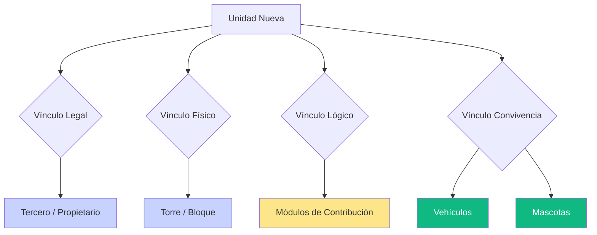

# Capítulo 5: El Ciclo de Vida de la Unidad (Creación y Vínculos)

## 1. La Unidad como Centro de la Operación

La creación de una **Unidad** es el momento en que la estructura física del inmueble se encuentra con la estructura financiera del sistema. Es aquí donde definimos quién es el responsable y bajo qué reglas va a contribuir.

### El Vínculo con el Tercero (Responsabilidad)
Todo recaudo debe estar amarrado a una cabeza responsable. El sistema exige asociar un **Propietario Principal** (extraído del módulo de Terceros). 
*   **Importante**: Una sola persona (Tercero) puede ser dueño de múltiples unidades, pero cada unidad tiene su propia hoja de vida financiera independiente.

---

## 2. Anatomía de la Creación (Datos Críticos)

Al matricular una unidad en **PH > Unidades > Crear**, debemos prestar atención a estos campos vitales:

1.  **Torre / Bloque / Zona**: Define la ubicación física. Como vimos en el capítulo 2, esto sirve para filtrar gastos que solo afecten a una infraestructura específica.
2.  **Código / Número**: El nombre descriptivo (Ej: "Apto 501", "Casa 12").
3.  **Tipo (Residencial/Comercial)**: 
    > [!NOTE]
    > Este campo es **Categórico e Informativo**. Ayuda a organizar reportes y estadísticas, pero no define el cobro por sí solo. Sin embargo, es vital para una correcta auditoría de inventario.
4.  **Coeficiente (%)**: **EL DATO MÁS CRÍTICO**. Es el valor decimal que representa el peso de la unidad sobre el presupuesto total. Si usted lanza un cobro de $10.000.000, el sistema usará este coeficiente para calcular cuánto le toca exactamente a esta unidad.
5.  **Área (m²)**: El tamaño físico registrado en la escritura.

---

## 3. La Conexión Lógica (Módulos de Contribución)

Al final del formulario, verá la lista de **Módulos de Contribución**. Aquí es donde el "Tipo" informativo se convierte en "Lógica" de cobro:
*   Debe marcar los módulos a los que esta unidad pertenece (Ej: Si es un local que paga administración comercial y parqueadero, marque ambos).
*   Esto es lo que garantiza que solo le lleguen los conceptos que le corresponden.

---

## 4. Información Integral: Vehículos y Mascotas

Para una verdadera **Gestión 360°**, la unidad permite registrar datos adicionales que, aunque no son financieros en origen, son vitales para la seguridad y convivencia:

*   **Vehículos**: Permite registrar placa, marca y color. Esto vincula el inventario de parqueo con el propietario legal.
*   **Mascotas**: Historial de nombres y especies. Facilita la gestión administrativa ante cualquier eventualidad en zonas comunes.

---

> [!TIP]
> **Visión de Consultoría**: Tener la unidad completamente documentada (con sus vehículos y módulos) reduce drásticamente las disputas de cobro y mejora la seguridad del recinto, ya que el sistema centraliza toda la información en un solo punto de verdad.

---
*Fin del Capítulo 5 - Con esto cerramos el ciclo integral de la unidad en el modelo de recaudos.*
